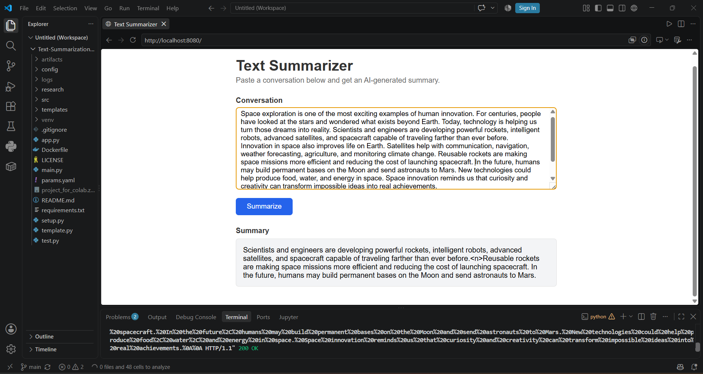

# 📝 Text Summarization using HuggingFace (Pegasus + SAMSum)

An end-to-end NLP pipeline that fine-tunes Google's **Pegasus** model on the **SAMSum** conversational dataset to generate abstractive summaries of conversations. The project follows a modular, production-style MLOps structure — covering data ingestion, validation, transformation, model training, and ROUGE-based evaluation — and is served through a **FastAPI** web application.


---

## 📸 Demo



---

## 📌 Overview

Text summarization condenses a long piece of text into a shorter version while preserving its key meaning. This project focuses on **abstractive summarization** — instead of just extracting existing sentences, the model generates new sentences that capture the essence of a conversation.

- **Base model:** [`google/pegasus-cnn_dailymail`](https://huggingface.co/google/pegasus-cnn_dailymail)
- **Fine-tuning dataset:** [SAMSum](https://huggingface.co/datasets/samsum) — a corpus of messenger-style conversations paired with human-written summaries
- **Evaluation metric:** ROUGE (ROUGE-1, ROUGE-2, ROUGE-L, ROUGE-Lsum)
- **Training environment:** Fine-tuned on a free Google Colab GPU
- **Serving:** FastAPI backend with a simple web UI for local testing

---

## 🚀 Features

- 🔄 Modular ML pipeline — data ingestion → validation → transformation → training → evaluation
- ⚙️ Configuration-driven design using `config.yaml` and `params.yaml`
- 📦 Reusable, testable components with a clean `src` package structure
- 🌐 FastAPI app with `/train` and `/predict` endpoints for retraining and inference
- 🐳 Dockerized for easy deployment
- 📊 ROUGE-based model evaluation for quantifying summary quality

---

## 🗂️ Project Structure

```
Text-Summarization-using-HuggingFace-Model/
├── assets/                  # Images and static assets (e.g., demo screenshot)
├── config/
│   └── config.yaml          # Paths and static configuration for each pipeline stage
├── research/                 # Jupyter notebooks used for experimentation
├── src/
│   └── textSummarizer/
│       ├── components/       # Core logic for each pipeline stage
│       ├── config/            # Configuration manager
│       ├── constants/         # Project-wide constant paths
│       ├── entity/            # Dataclasses defining configuration entities
│       ├── logging/           # Custom logger setup
│       ├── pipeline/          # Orchestrates each stage of the ML workflow
│       └── utils/             # Common helper functions
├── templates/                # HTML templates for the FastAPI web UI
├── Dockerfile                # Container definition for deployment
├── main.py                   # Entry point that runs the full training pipeline
├── app.py                    # FastAPI application (train + predict endpoints)
├── params.yaml                # Model/training hyperparameters
├── requirements.txt           # Python dependencies
├── setup.py                   # Package setup for the textSummarizer module
├── template.py                 # Script that scaffolds the project folder structure
├── test.py                    # Basic tests / sanity checks
└── LICENSE
```

---

## 🛠️ Tech Stack

| Category | Tools |
|---|---|
| Language | Python |
| Deep Learning | PyTorch, HuggingFace Transformers |
| NLP | HuggingFace Datasets, Tokenizers, evaluate (ROUGE) |
| API / Serving | FastAPI, Uvicorn, Jinja2 |
| Experimentation | Jupyter Notebook, Google Colab |
| Deployment | Docker |

---

## ⚙️ Installation

### 1. Clone the repository

```bash
git clone https://github.com/saurabhqr1/Text-Summarization-using-HuggingFace-Model.git
cd Text-Summarization-using-HuggingFace-Model
```

### 2. Create and activate a virtual environment

```bash
python -m venv venv
# Windows
venv\Scripts\activate
# macOS/Linux
source venv/bin/activate
```

### 3. Install dependencies

```bash
pip install -r requirements.txt
```

---

## ▶️ Usage

### Run the full training pipeline

This executes all stages — data ingestion, transformation, model training, and evaluation — as configured in `config/config.yaml` and `params.yaml`:

```bash
python main.py
```

### Launch the web app

```bash
python app.py
```

Then open `http://localhost:8080` in your browser. The app exposes:

- `GET /` — a simple web UI to paste text and get a summary
- `GET /train` — triggers the training pipeline
- `POST /predict` — returns a generated summary for input text

### Run with Docker

```bash
docker build -t text-summarizer .
docker run -p 8080:8080 text-summarizer
```

---

## 🔬 How It Works

1. **Data Ingestion** — Downloads and extracts the SAMSum dataset.
2. **Data Validation** — Confirms all expected files exist before proceeding.
3. **Data Transformation** — Tokenizes dialogues and summaries using the Pegasus tokenizer.
4. **Model Training** — Fine-tunes `google/pegasus-cnn_dailymail` on the transformed dataset using hyperparameters from `params.yaml`.
5. **Model Evaluation** — Scores the fine-tuned model on the test split using ROUGE metrics.
6. **Prediction Pipeline** — Loads the fine-tuned model/tokenizer to generate summaries for new input via the FastAPI `/predict` endpoint.

---

## 📄 License

This project is licensed under the [MIT License](LICENSE).

---

## 🙋 Author

**Saurabh Singh**
[GitHub](https://github.com/saurabhqr1) · [LinkedIn](https://www.linkedin.com/in/saurabh-singh-205781308) · [Email](mailto:saurabhsinghqr@gmail.com)
